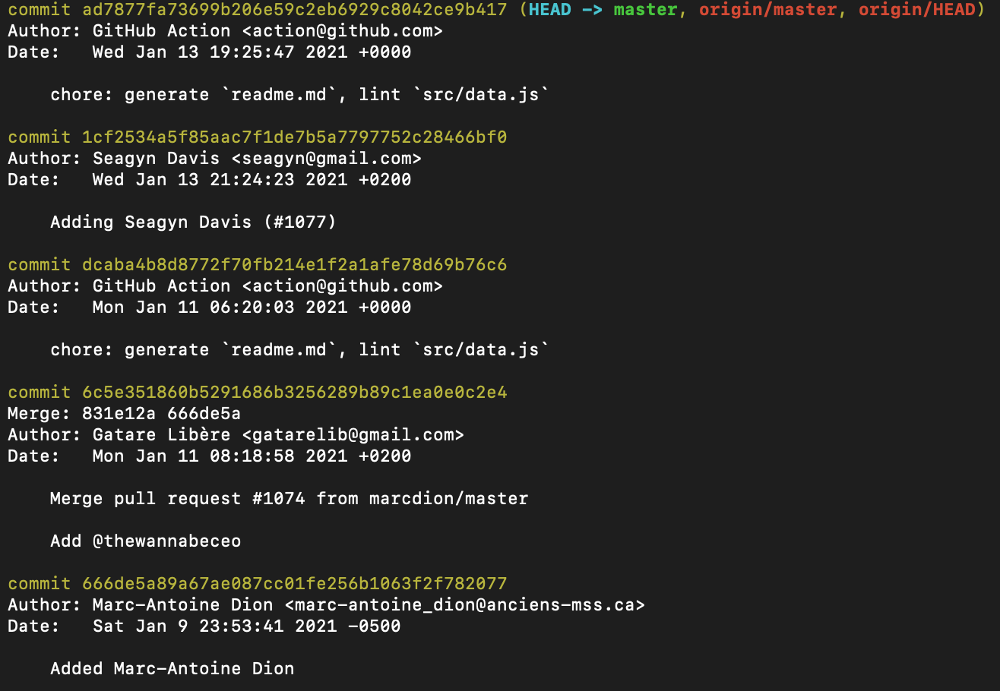
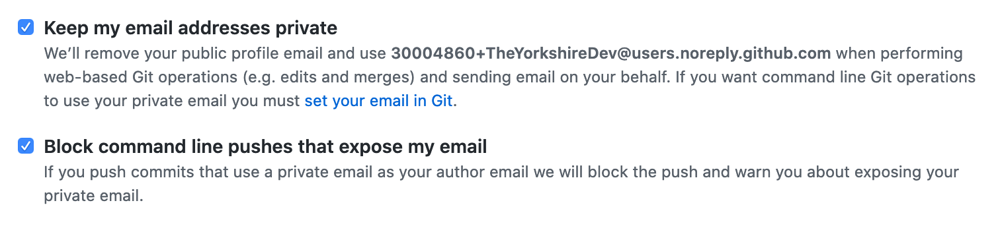

If you intend to develop in the public domain on opensource projects, you will need to set up Git. I'm going to outline my git configuration and discuss my approach.

## Email Address

When setting up Git, one of the first things you set up is your email address. Often not much thought is given to this step, however, if you use your private email address you are advertising your email address. Consequently, your email address could become subject to spam by a malicious actor who scrapes email address from git history.

For example, below is a screenshot of Wes Bos' [awesome-uses][1] repository. You can see several of the contributors have exposed their email addresses when committing to the project.



### My Configuration

I use the no-reply address for my GitHub account as my git email. On GitHub, you can find your no-reply email address in *Settings* > *Emails* > under "Keep my email addresses private".



You can then set your git email using this address:

```
git config --global user.email "30004860+TheYorkshireDev@users.noreply.github.com"
```

To avoid my email address from being exposed when performing actions through GitHub UI such as edits or merges, I check "Keep my email addresses private".

Finally, I check "Block command line pushes that expose my email" which blocks pushes with commits that include personal email addresses.

## Username

When setting up Git, alongside email, you need to set your name. I would recommend using your first and surname for this option, which most people will probably do automatically. It is worth noting if you are thinking of using a pseudonym in Git, it can violate some open source projects contribution guidelines. One such example is the Docker project, so to err on the side of caution, it might be worth sticking to your real name.

## Commit Signing

The final thing I have configured for open source development is commit signing. I'm not going to go over the advantages and disadvantages of commit signing in this post, for more details check out [this StackExchange post][2] and sub-links. Not everyone agrees on an approach to commit signing, but I tend to sign all my commits.

### Generate GPG Key

<Callout>

Use the `no-reply` email address when generating a GPG key.
</Callout>


I recommend following GitHub's official guide for [generating GPG keys][3].

### Add a GPG key to your GitHub Account

You will need to have noted down your public key to upload to GitHub. If you didn't, run the following to retrieve it:

```
gpg --armor --export <EMAIL_ADDRESS>
```

Again, I recommend following GitHub's official guide for [adding a GPG key to your GitHub account][4].

### Configure Local Environment

The following commands configure Git to always sign commits with the GPG key you have just generated.

<Callout>

You want the GPG key id you have just generated, run `gpg --list-secret-keys --keyid-format LONG` to find it again if you didn't note it down.
</Callout>

```
git config --global user.signingKey <REPLACE\_THIS\_WITH\_YOUR\_KEY\_ID>

git config --global commit.gpgSign true
```

To verify commit signing is configured, run the following:

```
echo "test" | gpg --clearsign
```

<hr />

What's your Git configuration? Do you have any feedback? Reach out and let's discuss.

[1]: https://github.com/wesbos/awesome-uses
[2]: https://softwareengineering.stackexchange.com/a/212216
[3]: https://docs.github.com/en/free-pro-team@latest/github/authenticating-to-github/generating-a-new-gpg-key
[4]: https://docs.github.com/en/github/authenticating-to-github/adding-a-new-gpg-key-to-your-github-account