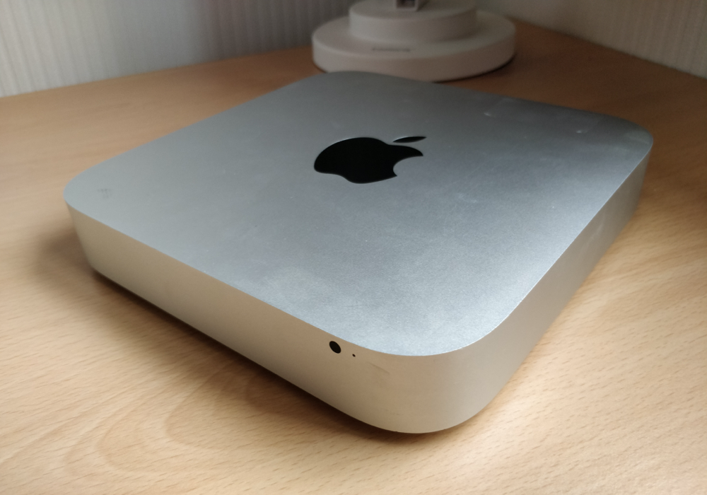
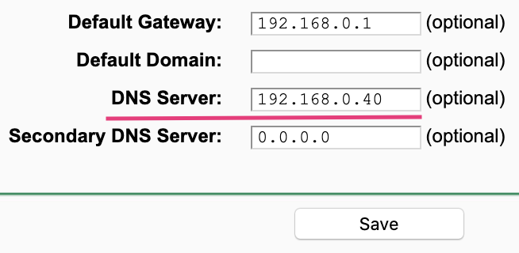

I've wanted to set up a Pi-hole on my home network for a while but never found the time. Similarly, my old Mac mini has been laying around for a few years now, and I have meant to make use of it. After the recent announcement that MacOS Big Sur will not be compatible with my 2012 Mac mini, I have decided to turn my mini into an Ubuntu server and install PiHole.

## Hardware

As touched upon already, I re-purposed an old 2012 Mac Mini. The Mac has an i5-3210M processor, 8GB of RAM and a 500GB hard disk. Using a Mac mini that is a small form-factor allowed me to position it nicely underneath my router.



## Install & Configure Ubuntu Server

The first step was to grab Ubuntu server and follow the installation instructions from the [official website][1]. I used a USB stick as the installation media. To boot from the USB, hold down the `⌘ Command` key when powering on the Mac to open up the boot menu.

<Callout>
During the install when specifying the disk to format the full disk was not selected by default. Therefore I had to expand the default size to utilise the whole disk.
</Callout>

### Update the System

<Preamble>
After the initial installation, I updated everything before continuing any further.
</Preamble>

```shell
apt update && apt upgrade -y
```

### Install Postfix for Email

To keep the server up to date unattended-upgrades are used. Reports from unattended-upgrades get emailed using Postfix.

<Preamble>
To install Postfix and initial config I ran the following:
</Preamble>

```shell
apt install postfix mailutils
cp /usr/share/postfix/main.cf.debian /etc/postfix/main.cf
```

<Preamble>

I used SendGrid as a relay host and followed their documentation for [configuring Postfix][2]. Below was the configuration I added to `/etc/postfix/main.cf`.
</Preamble>

```
smtp_sasl_auth_enable = yes
smtp_sasl_password_maps = hash:/etc/postfix/sasl_passwd
smtp_sasl_security_options = noanonymous
smtp_sasl_tls_security_options = noanonymous
smtp_tls_security_level = encrypt
header_size_limit = 4096000
relayhost = [smtp.sendgrid.net]:587
```

<Preamble>

To authenticate against Sendgrid using an API key, I created `/etc/postfix/sasl_passwd` to store the API key.
</Preamble>

```
[smtp.sendgrid.net]:587 apikey:<yourSendGridApiKey>
```

<Preamble>
Ensure the password file had the correct ownership and before restarting postfix.
</Preamble>

```shell
chmod 600 /etc/postfix/sasl_passwd
postmap /etc/postfix/sasl_passwd
systemctl restart postfix
```

<Preamble>
Test Postfix by sending an email:
</Preamble>

```shell
echo "Just testing postfix" | mail -s "[Test Email]" test@example.com
```

### Unattended Upgrades

As mentioned before, to ensure the Ubuntu Server is always patched, I configured unattended-upgrades which installs updates without manual interaction.

<Preamble>
Install unattended-upgrades:
</Preamble>

```shell
apt-get install unattended-upgrades apt-listchanges
```

#### Frequency Configuration

<Preamble>

The frequency of updates I used was based upon [this setup][3] which was suitable for my needs.
Within `/etc/apt/apt.conf.d/20auto-upgrades` I set the following:
</Preamble>

```
APT::Periodic::Update-Package-Lists "1";
APT::Periodic::Download-Upgradeable-Packages "1";
APT::Periodic::Unattended-Upgrade "3";
APT::Periodic::AutocleanInterval "9";
```

- `APT::Periodic::Update-Package-Lists "1";`
    - I update the package lists daily. This is important because unattended-upgrades can fail if the sources are outdated.
- `APT::Periodic::Download-Upgradeable-Packages "1"`
    - I also download the updates daily too rather than downloading them all in one go.
- `APT::Periodic::Unattended-Upgrade "3";`
    - Perform the installation every three days.
- `APT::Periodic::AutocleanInterval "9"`
    - Clean the package cache every nine days.

#### unattended-upgrades Configuration

In the unattended-upgrades configuration file, I set the `Unattended-Upgrade::Mail` property to my email address.

<Preamble>
I also set automatic reboot and the time to reboot too:
</Preamble>

```
Unattended-Upgrade::Automatic-Reboot "true";
Unattended-Upgrade::Automatic-Reboot-Time "02:00";
```

## Install & Setup PiHole

The inspiration for setting up Pi-Hole came from reading a [blog post][4] by [Scott Helme][5], where he outlined the steps he undertook. Alongside, setting up Pi-Hole to filter out advertisements on my home network, I also set up DNS over HTTPS (DoH). DoH facilitates the secure transmission of DNS.

### Installing Cloudflared

Cloudflared is used as a proxy to enable DNS over HTTPS. Pi-Hole has good [documentation for installing Cloudflared][6]. I installed cloudflared the "automatic" way outlined in the link above, below are the steps I undertook.

<Preamble>
Install Cloudflared:
</Preamble>

```shell
wget https://bin.equinox.io/c/VdrWdbjqyF/cloudflared-stable-linux-amd64.deb
apt-get install ./cloudflared-stable-linux-amd64.deb
cloudflared -v
```

<Preamble>
To configure cloudflared, I used a config file to specify the upstream DNS location DoH requests should be routed.
</Preamble>

```shell
mkdir /etc/cloudflared/
vi /etc/cloudflared/config.yml
```

<Preamble>

`config.yml` file content points to CloudFlare's DNS servers.
</Preamble>

```
proxy-dns: true
proxy-dns-port: 5053
proxy-dns-upstream:
  - https://1.1.1.1/dns-query
  - https://1.0.0.1/dns-query
#Uncomment following if you want to also want to use IPv6 for external DOH lookups
  #- https://[2606:4700:4700::1111]/dns-query
  #- https://[2606:4700:4700::1001]/dns-query
```

<Callout>
  The DNS proxy port is needed later on.
</Callout>

<Preamble>
Once the config was in place, I installed cloudflared as a service:
</Preamble>

```shell
cloudflared service install --legacy
systemctl start cloudflared
systemctl status cloudflared
```

<Preamble>

To test DNS routed via cloudflared works you can run `dig`:
</Preamble>

```shell
dig @127.0.0.1 -p 5053 google.com
```

### Installing and configuring the Pi-Hole

Installing Pi-Hole was trivial, I just ran the following command and proceeded through the install instructions:

<Callout>
It did not matter the default DNS configuration I choose since I override the setting after installation.
</Callout>

```shell
curl -sSL https://install.pi-hole.net | bash
```

After the installation was complete, I updated a couple of configuration files to ensure Pi-Hole was routing DNS through the cloudflared service.

<Preamble>

Within `/etc/pihole/setupVars.conf` remove the values for `PIHOLE_DNS_1` and `PIHOLE_DNS_2`. This stops Pi-hole from using the DNS configuration chosen when setting up Pi-hole.
</Preamble>

```
...
PIHOLE_DNS_1=
PIHOLE_DNS_2=
...
```

I also created an additional configuration file for `dnsmasq` to route DNS through the cloudflared service.

<Callout>

The port (after `#`) should match the DoH proxy port configured in cloudflared
</Callout>

<Preamble>

Create `/etc/dnsmasq.d/cloudflared-dns.conf`:
</Preamble>

```
server=127.0.0.1#5053
```

<Preamble>
I then restarted the pihole-FTL service to use the updated config.
</Preamble>

```shell
systemctl restart pihole-FTL
systemctl status pihole-FTL
```

### Configuring devices to use Pi-Hole

To enable all of my devices to utilise Pi-Hole, I chose to set the network DNS servers on my router so, all devices will be routed through Pi-Hole and DoH by default.



<hr />

A few resources that I used during my setup that may also be of use:

- [Install outgoing email from Debian/Ubuntu system through SendGrid][7]
- [Integrate Postfix with SendGrid][2]
- [Debian Unattended Upgrades Docs][8]
- [@roybotnik Unattended Upgrades Setup][9]
- [Install Cloudflared][6]
- [Install Pi-Hole][10]

<hr />

Have you installed and configured Pi-Hole? Do you have any feedback? Reach out and let's discuss.

[1]: https://ubuntu.com/tutorials/install-ubuntu-server#1-overview
[2]: https://sendgrid.com/docs/for-developers/sending-email/postfix/
[3]: https://gist.github.com/roybotnik/b0ec2eda2bc625e19eaf#frequency-configuration
[4]: https://scotthelme.co.uk/securing-dns-across-all-of-my-devices-with-pihole-dns-over-https-1-1-1-1/
[5]: https://twitter.com/Scott_Helme
[6]: https://docs.pi-hole.net/guides/dns/cloudflared/
[7]: https://gist.github.com/wnasich/71093e406c07ed3f03f63da8abd6ce97
[8]: https://wiki.debian.org/UnattendedUpgrades
[9]: https://gist.github.com/roybotnik/b0ec2eda2bc625e19eaf
[10]: https://docs.pi-hole.net/main/basic-install
